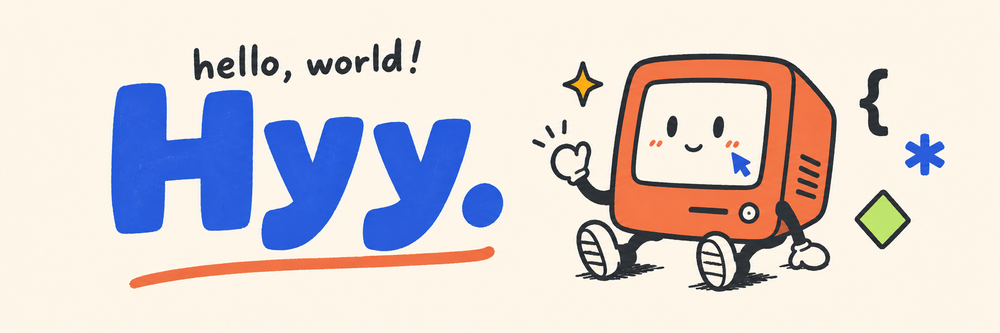

**前端工程师 · 开发者工具 · AI / LLM 探索者**

用 TypeScript 构建 Web 应用与开发者工具，也通过可视化和动手实践理解 AI / LLM。

  
  
  
  
  

## 🧩 精选项目

<table>
  <tr>
    <td width="50%" valign="top">
      <h3>🎨 <a href="https://github.com/hyy215/ui-forge">ui-forge</a></h3>
      
从需求与设计， 构建真实可交互的前端。

      
<code>TypeScript</code>

    </td>
    <td width="50%" valign="top">
      <h3>🧠 <a href="https://github.com/hyy215/ai-study">AI Study</a></h3>
      
拆解 AI / LLM 核心概念， 提供交互式可视化实验。

      
<code>TypeScript</code> <code>Transformers.js</code> <code>Weaviate</code>

    </td>
  </tr>
</table>

## 👋 我在做什么

- 💻 使用 **TypeScript**、**React** 和 **Node.js** 构建前端应用
- 🧩 关注浏览器扩展、VS Code 扩展与 **Eclipse Theia** 等开发者工具生态
- 🤖 关注 AI 的发展
- ✍️ 在[个人博客](https://hyy215.github.io/)记录前端工程与技术实践

## 🧰 技术栈

**前端开发**

  
  
  
  

**开发者工具**

  
  
  

  

    <a href="https://github.com/hyy215?tab=repositories">浏览更多项目 →</a>
  

  持续写代码，持续记录，也持续把复杂的问题讲清楚。

